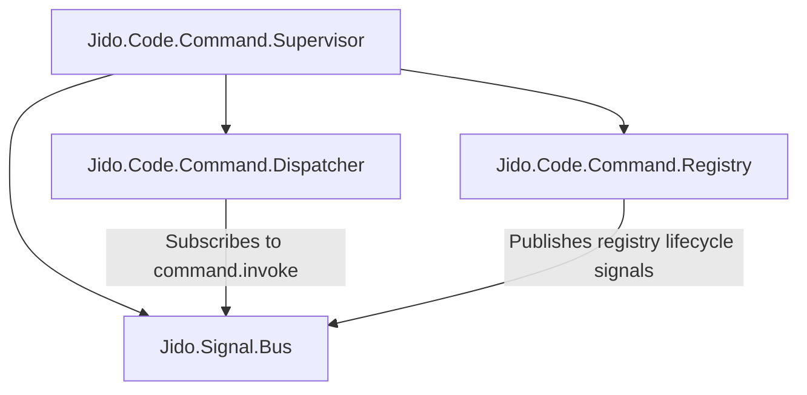
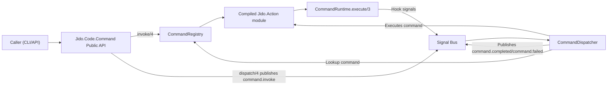

# Architecture

`jido_command` is a command-only runtime. Commands are markdown declarations compiled into `Jido.Action` modules and executed either directly (`invoke`) or through bus signals (`dispatch` + dispatcher).

## Supervisor topology

## Runtime component map

## Key invariants

- Commands are loaded from both global and local roots, with local precedence.
- Command payload validation is strict for both public API and dispatcher input.
- Runtime-managed context keys are normalized before execution: `:bus`, `:invocation_id`, `:permissions`.
- Only two optional hook signals are supported: `jido.hooks.pre` and `jido.hooks.after`.
- No extension/manifest abstraction is used; command markdown is the only dynamic declaration surface.

## Important modules

- `Jido.Code.Command`: public API (`list_commands`, `invoke`, `dispatch`, `reload`, `register_command`, `unregister_command`)
- `Jido.Code.Command.Application`: boot, settings load, supervision
- `Jido.Code.Command.Config.Loader` / `Jido.Code.Command.Config.Settings`: settings merge + validation
- `Jido.Code.Command.Registry`: command catalog and runtime registration
- `Jido.Code.Command.Dispatcher`: `command.invoke` subscriber and async execution queue
- `Jido.Code.Command.Frontmatter`: command markdown parser + validation
- `Jido.Code.Command.Compiler`: compilation to `Jido.Action` modules
- `Jido.Code.Command.Runtime`: template interpolation, hook emission, permission filtering
