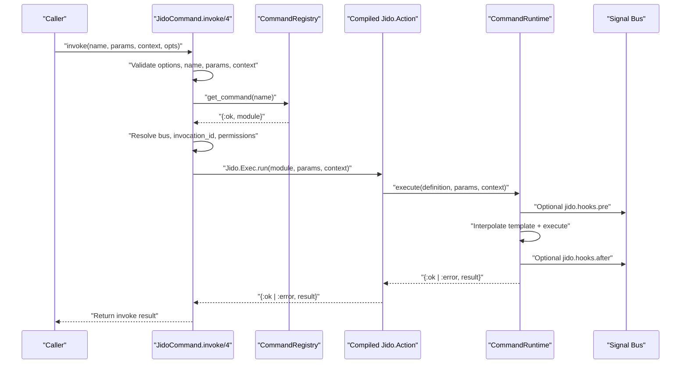
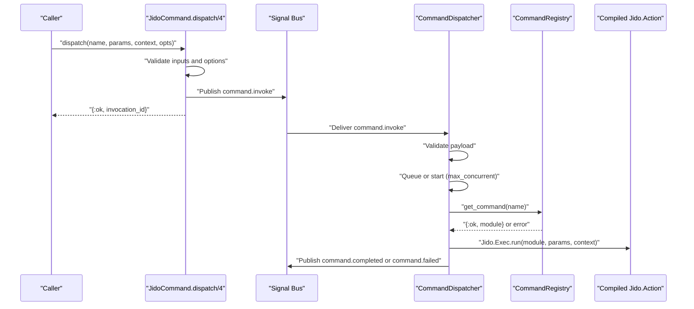

# Command Lifecycle

This page documents how commands move through runtime paths.

## Path A: Direct API invoke (`JidoCommand.invoke/4`)

Notes:

- `invoke/4` returns execution result directly.
- `command.completed` / `command.failed` are not emitted on this direct path.

## Path B: Signal dispatch (`JidoCommand.dispatch/4` -> dispatcher)

Notes:

- Dispatcher always publishes completion/failure signals for the dispatch path.
- Invalid payloads are converted to `command.failed` with explicit validation messages.
- Execution is asynchronous with queue backpressure (`max_concurrent`).

## Runtime-managed context keys

Before execution, runtime normalizes and injects:

- `:bus`
- `:invocation_id`
- `:permissions`

String aliases (`"bus"`, `"invocation_id"`, `"permissions"`) are removed when these runtime-managed keys are applied.
