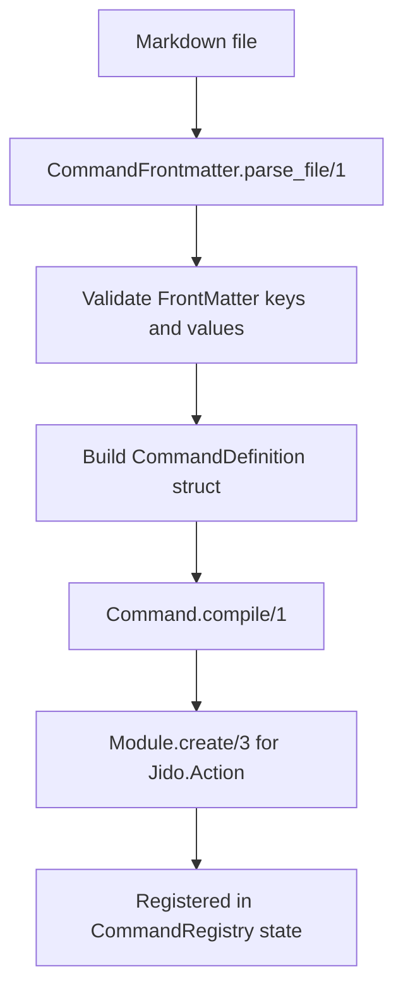

# FrontMatter and Compilation

Command modules are built from markdown files in `commands/*.md`.

## Compilation pipeline

## FrontMatter shape

Top-level keys:

- Required: `name`, `description`
- Optional: `model`, `allowed-tools` or `allowed_tools`, `jido`

Any unknown top-level key is rejected.

## `jido` map

Supported keys:

- `command_module`
- `schema`
- `hooks`

### Hooks

Only these hook keys are accepted:

- `pre`
- `after`

Hook values must be booleans (or omitted).

### Schema

Each schema field entry supports:

- `type`
- `required`
- `doc`
- `default`

Supported `type` values:

- `string`, `integer`, `float`, `boolean`, `map`, `atom`, `list`

Validation highlights:

- Field name format: `^[a-z][a-zA-Z0-9_]*$`
- `required: true` cannot also define `default`
- `default` must match declared field type

## Allowed tools parsing

- `allowed-tools` and `allowed_tools` are aliases; both together are rejected.
- Input may be comma string or list.
- Values are trimmed, empty entries removed, and de-duplicated.
- Empty resolved lists are rejected.

## Dynamic module naming

If `jido.command_module` is not provided, a deterministic module is generated using:

- command `name`
- source path hash digest

That yields stable module identities while avoiding collisions.

## Recompile behavior

Before creating a compiled module, runtime purges/deletes a previously loaded module of the same name.
This prevents stale code for reloaded or re-registered commands.
