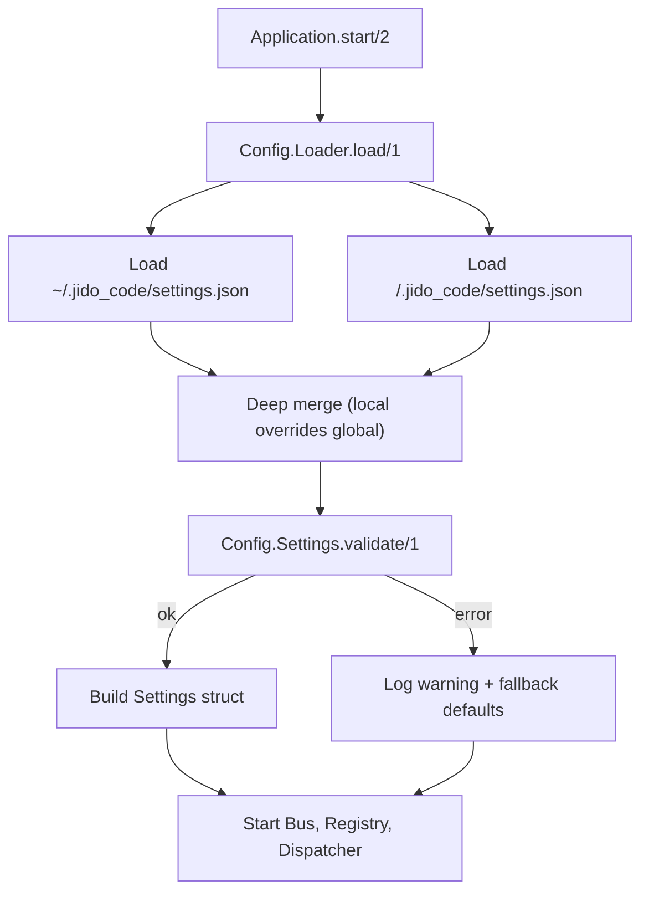

# Settings and Startup

`Jido.Code.Command.Application` builds runtime configuration from global and local `settings.json` files.

## Startup flow

## Loader behavior

- Missing settings files are treated as empty maps.
- Invalid JSON returns a load error.
- Merged settings are validated before use.

## Validation behavior

Supported top-level keys:

- `$schema`
- `version`
- `signal_bus`
- `permissions`
- `commands`

Validation is strict:

- Unknown keys are rejected (top-level and nested).
- Conflicting normalized keys are rejected (for example `allow` and `:allow`).
- Type and value constraints are enforced.

## Settings to runtime mapping

- `signal_bus.name` -> bus process name (default `:jido_code_bus`; string values are trimmed, optional leading `:` is removed, and the normalized name must be non-empty)
- `signal_bus.middleware` -> bus middleware tuple list
- `commands.default_model` -> default command model during compilation
- `commands.max_concurrent` -> dispatcher in-flight limit
- `permissions.allow|deny|ask` -> dispatcher runtime permissions
- Registry/dispatcher startup bus targets normalize binary names (trim + optional leading `:`) and reject invalid empty-normalized targets

## Failure fallback

If loading or validation fails at startup:

- Runtime logs a warning.
- Default `Settings{}` is used.
- The app still boots with safe defaults.
